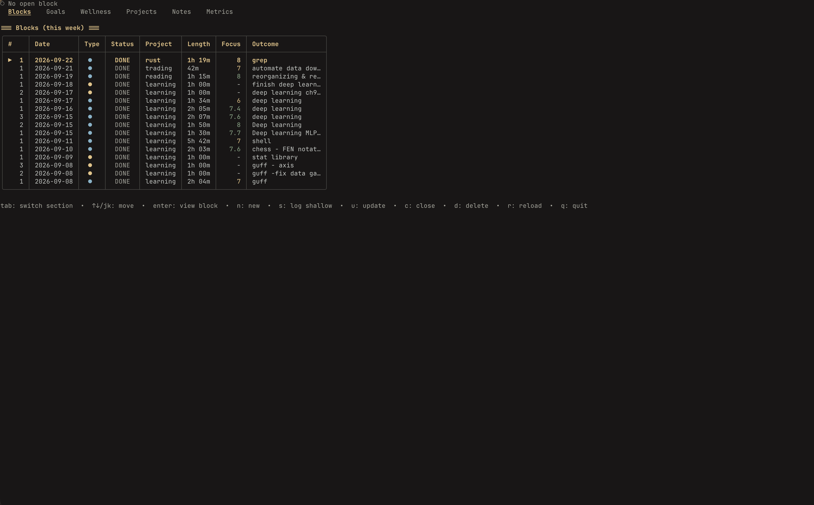
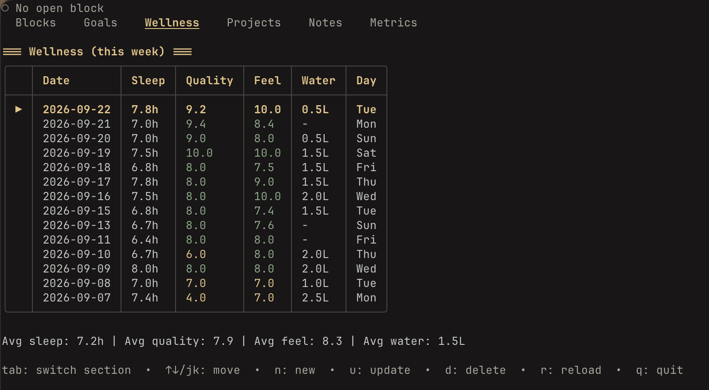
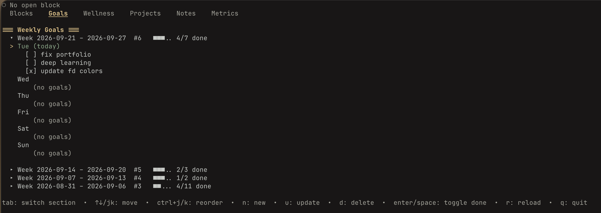
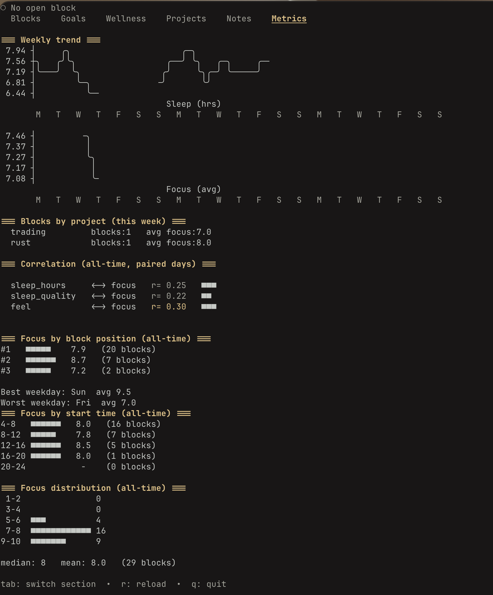

# journal

A little TUI for running your day in 1.5-hour focus blocks. Tracks sleep and
feel too, and keeps a weekly goal list. Everything lives in a local SQLite
file (`journal.db`) — no accounts, no syncing, no cloud.

## Build

```bash
go build -o journal .
```

## The easy way: `journal tui`

Run `journal tui` and you get a full dashboard — blocks, goals, sleep,
projects, notes, and metrics, all in one screen. Tab between sections,
`n` to create, `u` to update, `d` to delete, `enter` to view detail. Press
`enter` on the Notes tab to open a project's notes in nvim.

If you'd rather script things or run from a habit-tracking cronjob, every
piece is also its own CLI command:

### Blocks

| Command | What it does |
|---|---|
| `journal start` | Start a new block — prompts for project, outcome, context reload. |
| `journal update` | Mid-block check-in on the open block (done notes, deliverable, files/links — all optional). |
| `journal close` | Close the open block — done, not done, next step, an optional tweak, and a focus rating (1–10). |
| `journal log` | Log a shallow-work session that already happened, ending now. |
| `journal block list [--from] [--to] [--project]` | List blocks, any date range or project. |
| `journal block show <id>` | Full detail for one block. |
| `journal block for <project>` | All blocks for a project, by name or id. |
| `journal block reassign <block_id> <project_id>` | Move a block to a different project. |

### Sleep / daily check-in

`journal sleep log [--hours] [--quality] [--feel] [--water] [--day] [--notes]` —
logs sleep hours, sleep quality, feel, and water intake for a day. Leaves out
flags get prompted for. Re-running for the same day just updates it.

### Weekly goals

`journal goal add/list/done/edit/delete` — a simple weekly goal list, numbered
so you can reference them quickly (`journal goal done 2`).

### Projects
`journal project add/list/rename/delete` — projects are just names blocks get
tagged with. Can't delete one that has blocks logged against it.

### Metrics

| Command | What it does |
|---|---|
| `journal week` | This week's goals plus everything logged this week. |
| `journal metrics week` | Block count and avg focus per project, this week. |
| `journal metrics sleep` | Daily sleep/quality/feel log and weekly averages. |
| `journal metrics correlate` | How sleep hours/quality/feel correlate with focus quality. Needs 3+ paired days, 14+ for anything meaningful. |

## Example

```bash
$ journal sleep log
Sleep hours (0-24): 7.5
Sleep quality (1-10): 8
Feel (1-10): 7
Water intake (L) (0-10): 2

Checkin saved for 2026-08-16: sleep=7.5h quality=8 feel=7 water=2.0L

$ journal start
Project:
  1) work
  2) side-project
Choose number: 1
Outcome: Ship journal block list/show
Context reload: Picked up from yesterday's plan
Block #1 started (id=14)

$ journal close
Done: block list and block show both working
Not done: haven't wired up the project-delete safety check yet
Exact next step to start with: add the blocks-referencing-project guard
Files/links (leave blank to skip):
Focus quality (1-10): 8
One tweak for next block (leave blank to skip): write the guard clause first

Block #1 closed (id=14)
```

## License

See [LICENSE](LICENSE).
